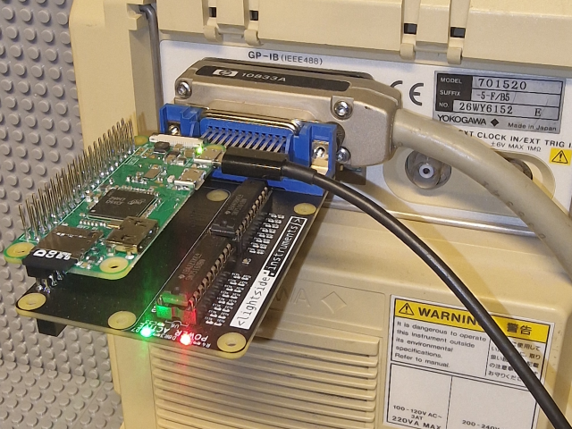
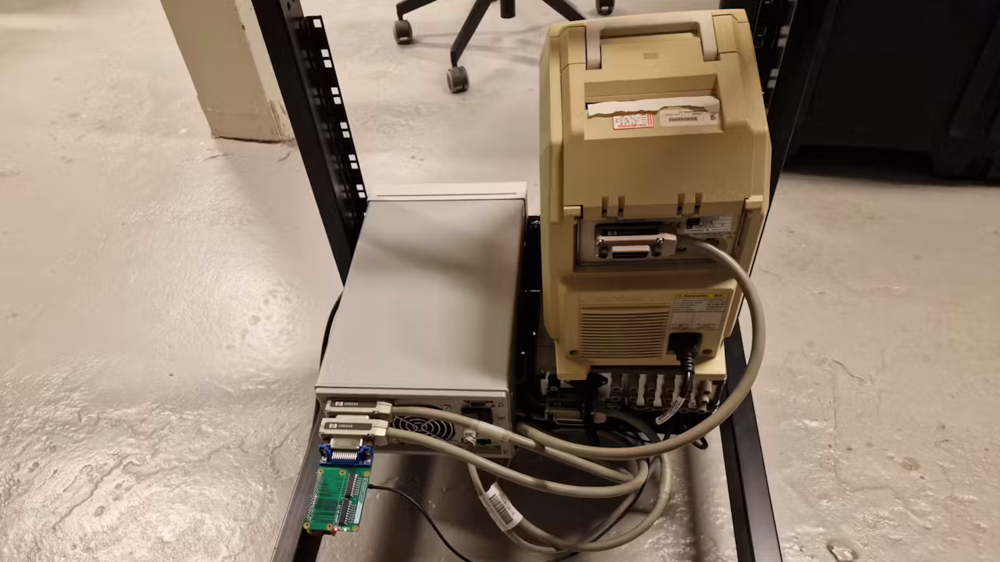

# The gpib4pi - GPIB for Raspberry Pi hat


# Introduction
We wanted to manage instruments with GPIB interface from a Raspberry Pi. We also wanted a board that had an opensource KiCAD project that we can modify and produce ourselves when needed.
We decided to base the design on the pinout already supported in the gpib_bitbang.ko driver part of the linux-gpib project and the schematics of a board that supports that pinout - http://elektronomikon.org (if you have one of these boards you can use them too)
However since they did not provide KiCAD design files and BOM for the production of PCB we designed one in KiCAD and published it https://github.com/lightside-instruments/gpib4pi . Feel free to either produce it yourself or buy it on Amazon https://www.amazon.com/dp/B0BY32HH4G or from our webstore - https://lightside-instruments.com/product/gpib4pi
3 improvements to the original elektromikron design:

* Mounting holes for Raspberry Pi Zero form factor control boards
* Pull-up and pull-down SMD resistors matching the IEEE standard values instead of slightly deviating throug-hole arrays present on the elektromikron board
* Complete board design and BOM not only schematic

# Installation
I started off with a default image (2023-12-05-raspios-bookworm-armhf-lite.img) different one will likely work too) on the Raspberry Zero W (or other Raspberry Pi 2-4). Create empty file named ssh in the 'boot' partition to enable ssh. Boot and log in as root. Configure internet connectivity. Follow these steps (N.B. if you are using version older than bookworm use 4.3.5-lsi4 instead of 4.3.5-lsi5):

```
apt-get -y update
apt-get -y upgrade
apt-get -y install git
git clone -b debian/4.3.5-lsi5 https://github.com/lightside-instruments/gpib-debian.git gpib
rsync -rav gpib/ gpib_4.3.5
rm -rf gpib_4.3.5/.git
rm -rf gpib_4.3.5/debian
tar -czvf gpib_4.3.5.orig.tar.gz gpib_4.3.5
rm -rf gpib_4.3.5

apt-get -y install devscripts
apt-get -y install dh-python bison flex doxygen docbook-utils docbook-to-man tcl8.6-dev python3-all-dev
cd gpib
debuild -us -uc
cd ..
ls -1 *.deb
#gpib-modules-source_4.3.5-lsi5_all.deb
#libgpib-bin-dbgsym_4.3.5-lsi5_armhf.deb
#libgpib-bin_4.3.5-lsi5_armhf.deb
#libgpib-dev_4.3.5-lsi5_armhf.deb
#libgpib-doc_4.3.5-lsi5_all.deb
#libgpib-perl-dbgsym_4.3.5-lsi5_armhf.deb
#libgpib-perl_4.3.5-lsi5_armhf.deb
#libgpib0-dbgsym_4.3.5-lsi5_armhf.deb
#libgpib0_4.3.5-lsi5_armhf.deb
#libtcl8.6-gpib-dbgsym_4.3.5-lsi5_armhf.deb
#libtcl8.6-gpib_4.3.5-lsi5_armhf.deb
#python3-gpib-dbgsym_4.3.5-lsi5_armhf.deb
#python3-gpib_4.3.5-lsi5_armhf.deb
dpkg -i *.deb

apt-get install module-assistant
apt-get install raspberrypi-kernel-headers

module-assistant auto-install gpib-modules-source
```

You will need to create the configuration file. This is the configuration file created for my setup:

[/usr/etc/gpib.conf](gpib.conf):

```
interface {
	minor = 0			/* board index, minor = 0 uses /dev/gpib0, minor = 1 uses /dev/gpib1, etc. */
	board_type = "gpib_bitbang"	/* name of the driver */
	name = "raspi_gpio_interface"	/* optional name, allows you to get a board descriptor using ibfind() */
	pad = 0				/* primary address of interface             */
	sad = 0				/* secondary address of interface           */
	timeout = T3s			/* timeout for commands */

	eos = 0x0d	/* EOS Byte, 0xa is newline and 0xd is carriage return */
	set-reos = yes	/* Terminate read if EOS */
	set-bin = no	/* Compare EOS 8-bit */
	set-xeos = no	/* Assert EOI whenever EOS byte is sent */
	set-eot = yes	/* Assert EOI with last byte on writes */

/* settings for boards that lack plug-n-play capability */
	base = 0	/* Base io ADDRESS                  */
	irq  = 0	/* Interrupt request level */
	dma  = 0	/* DMA channel (zero disables)      */

	master = yes	/* interface board is system controller */
}


device {
	minor = 0
        name = "relay-actuator-hp-59306a"
        pad = 1
        sad = 0

        eos = 0x0a
        set-reos = no
        set-bin = no
}
device {
	minor = 0
        name = "dc-power-supply-agilent-e3647a"
        pad = 2
        sad = 0

        eos = 0x0a
        set-reos = no
        set-bin = no
}
device {
	minor = 0
        name = "digital-oscilloscope-yokogawa-dl1540l"
        pad = 3
        sad = 0

        eos = 0x0a
        set-reos = no
        set-bin = no
}
```

This is the corresponding test setup:

Now you can load the module and load the configuration:

```
modprobe gpib_bitbang
gpib_config
```

* if you are using the older gpib4pi-1.1 board add the board_id kernel module parameter board_id=gpib4pi-1.1 value e.g. modprobe gpib_bitbang board_id=gpib4pi-1.1
At this point you can either use the ibtest and ibterm standard tools or write your own programs.
# Writing
[gpibtest.py](gpibtest.py):

```python
import gpib

con=gpib.dev(0,1)

gpib.write(con,'A1B23456')
```

Running:

```
python gpibtest.py
```

This connects channel A1 to C1 of the classic HP 59306A Relay Actuator while the remaining C channels are connected to their B counterpart.
Same in C.

[gpibtest.c](gpibtest.c):

```C
#include <gpib/ib.h>

int main() {
    int dev;

    dev=ibdev(0,1,0,T3s,0,0);
    ibwrt(dev,"A1B23456",8);
}
```

Running:

```
gcc gpibtest.c -lgpib -o gpibtest
./gpibtest
```

Here is the script used to produce the video enabling A<->C switch connections for 1, 2 and 3 in a loop.
[gpibtest-loop.py](gpibtest-loop.py):

```python
import gpib
import time

con=gpib.dev(0,1)

gpib.write(con,'B123456')
i=0
while(i<10):
        gpib.write(con,'A1B3')
        time.sleep(0.1)
        gpib.write(con,'A2B1')
        time.sleep(0.1)
        gpib.write(con,'A3B2')
        time.sleep(0.1)
        i=i+1
```

# Diode characterization example
For a more complex example we convert  the Diode characterization example from the Keysight E364xA Dual Output DC Power Supplies User’s and Service Guide  to Python -
[diode.py](diode.py):

```python
import gpib
import time

def cmd(con, cmd):
        result = ""
        gpib.write(con,cmd)

        c = gpib.read(con,2048)
        result=c.decode("utf-8")

        return result


con=gpib.dev(0,2)


reply=cmd(con,'*IDN?\n')
print("Instrument identification string:")
print("    " + reply)

gpib.write(con,'*RST\n')        # Set power-on condition
gpib.write(con,'Current 0.5\n') # Set current limit to 0.5A
gpib.write(con,'Output on\n')   # Turn output on

print("Voltage Current\n\n")

# Step from 0.6 to 0.8 volt in 0.02 step
voltage = 0.6
while(voltage<0.8001):
    voltage = voltage + 0.02
    # Set output voltage
    gpib.write(con,'Volt %f\n'%(voltage))
    time.sleep(0.5)
    # Measure output current
    reply = cmd(con,"Measure:Current?\n")
    current=float(reply)
    print("%.3f %6.4f\n"%(voltage, current))

gpib.write(con,'Output off\n') # Turn output off
```
Running the program:

```
pi@raspberrypi:~ $ sudo python diode.py 
Instrument identification string:
    Agilent Technologies,E3647A,0,1.7-5.0-1.0

Voltage Current

0.620 -0.0000

0.640 -0.0000

0.660 0.0000

0.680 0.0001

0.700 0.0003

0.720 0.0008

0.740 0.0016

0.760 0.0035

0.780 0.0074

0.800 0.0154

0.820 0.0301

pi@raspberrypi:~ $
```

# Oscilloscope Waveform Capture (DL1540L)
[oscilloscope.py](oscilloscope.py):

```python
import sys
import gpib
import time
import os

def cmd(con, cmd):
        result = ""
        gpib.write(con,cmd)

        c = gpib.read(con,2048)
        result=c.decode("utf-8")

        return result

def setup_channel(channel):
        reply=cmd(con, ':CHANnel'+str(channel)+'?\n')
        print (reply)
        gpib.write(con,':CHAN'+str(channel)+':MODE ON\n')
#       gpib.write(con,':CHAN'+str(channel)+':POS 0\n')
        gpib.write(con, 'CHAN'+str(channel)+':VDIV:VALue 50V\n')


def read_waveform(trace) :
        gpib.write(con, 'WAVeform:TRACE '+ str(trace) + '\n')

        gpib.write(con, 'WAVeform:FORMAT ASCII\n')

        gpib.write(con, 'WAVeform:START ' + str(0) + '\n')
        gpib.write(con, 'WAVeform:END '+ str(110-1) + '\n')

        reply=cmd(con, "WAVeform:BITS?\n")
        print(reply)

        reply=cmd(con, "WAVeform:TYPE?\n")
        print(reply)

        reply=cmd(con, 'WAVeform?\n')
        print(reply)
        reply=cmd(con, "WAVeform:SEND?\n")
        print(reply)

con=gpib.dev(0,3)

#gpib.write(con, '*RST\n')
reply=cmd(con, '*IDN?\n')
print (reply)
reply=cmd(con, ':CHANnel'+str(1)+'?\n')
print (reply)


gpib.write(con,':TIM:TDIV 100ns\n')

setup_channel(1)
setup_channel(2)
setup_channel(3)
setup_channel(4)

gpib.write(con, 'START\n')

time.sleep(2)

gpib.write(con,':STOP\n')

read_waveform(1)
read_waveform(2)
read_waveform(3)
read_waveform(4)
```

# Features not tested
Event notification using SRQ event https://www.keysight.com/zz/en/lib/resources/training-materials/using-srq-events.html were not tested.
