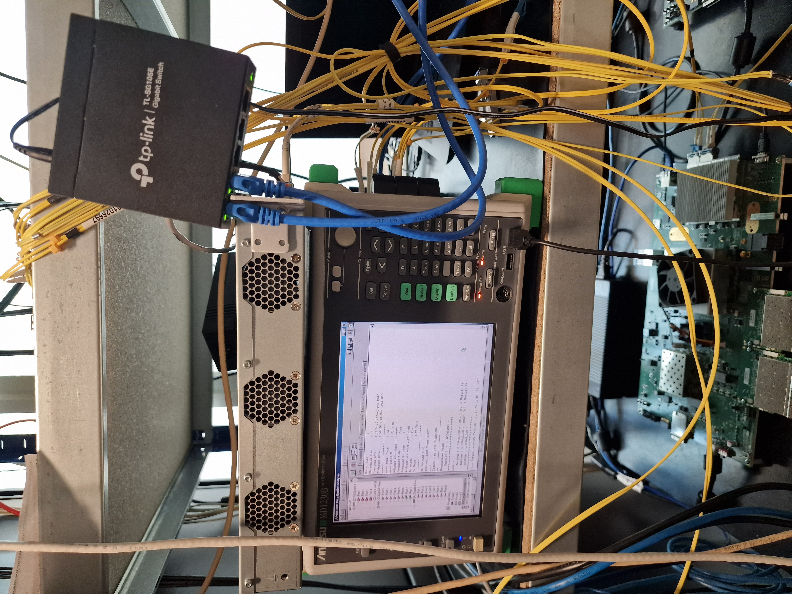

# Тема: Измерване и съпоставка на производителността на мрежови устройства.

* https://lightside-instruments.com

* https://www.ietf.org/rfc/rfc2544.txt (RFC2544)

* 

* https://datatracker.ietf.org/doc/html/draft-ietf-bmwg-network-tester-cfg

* 

* 

* 

