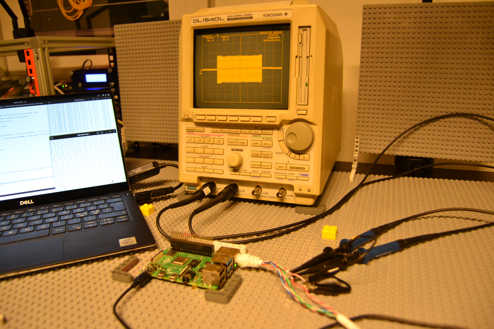
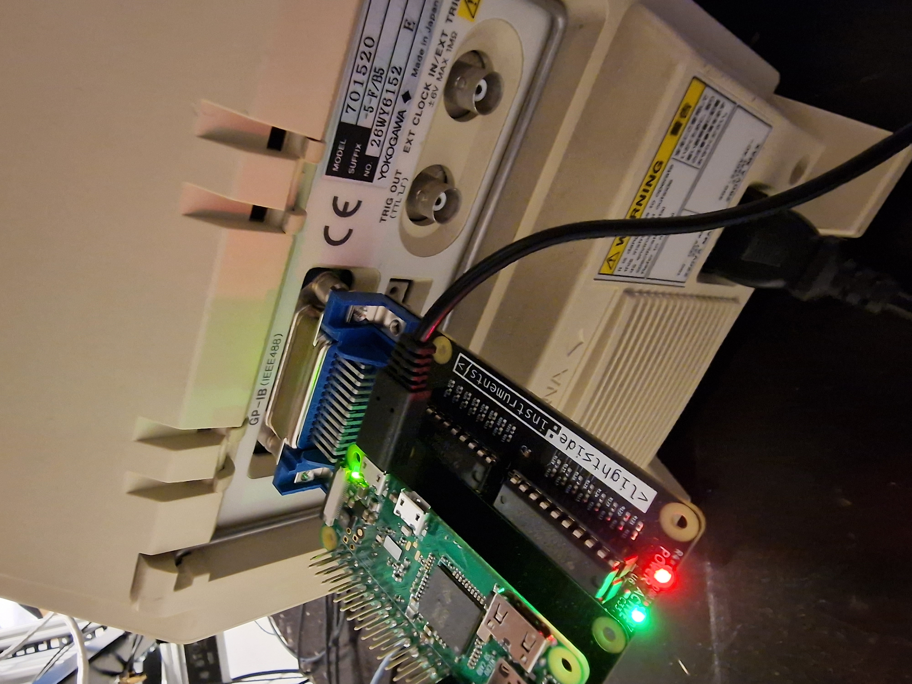

# Capturing Ethernet Frame with Scope


# Introduction
This document describes method for capturing Ethernet (10BASE-T) frame with oscilloscope. The process described has these steps:

* connect two channels with probes latched to the Ethernet cable - TX pair 2 - orange/white channel1, orange channel2
* setting a scope trigger for the start of frame condition
* reading the discrete samples representing the analog voltage from each of the twisted pair wires
* subtracting the second from the first channels to get a differential signal
* lowpass filtering the oversampled signal (optional)
* generating a binary 0s and 1s pulsetrain representation of the filtered oversampled signal
* detection of frame beginning
* decoding of the manchester encoded frame data
* printing frame data upon end of frame detection to standard output

# Generating frames
You can generate repeatable frame of minimal size that does not change its contents and preferably is sent out periodically. The bellow command line tool does that with 10 ms intervals and the frame sent is an :
```
sudo traffic-generator --interface-name=eth0 --frame-size=64 --interframe-gap=12436  --interface-speed=10000000 --frame-data="FFFFFFFFFFFFE45F01E3FE7208060001080006040001E45F01E3FE720A0000030000000000000A00000200000000000000000000000000000000000084919005"
```

# Validating the frame is actually sent with tcpdump

```
sudo tcpdump -i enx180f76faabfe
listening on enx180f76faabfe, link-type EN10MB (Ethernet), snapshot length 262144 bytes
00:59:43.322021 ARP, Request who-has 10.0.0.2 tell 10.0.0.3, length 46
00:59:43.332066 ARP, Request who-has 10.0.0.2 tell 10.0.0.3, length 46
00:59:43.342078 ARP, Request who-has 10.0.0.2 tell 10.0.0.3, length 46
...
```

# Capturing with python script using linux-gpib (e.g. gpib4pi)



The following command line tool (sources provided) calls do the specified steps:

```
sudo apt-get install python3 gcc octave-cli
python3 oscilloscope.py | tee out.txt
cat out.txt | grep ch1 | head -n 1 > channels.m
cat out.txt | grep ch2 | head -n 1 >> channels.m
octave-cli ethfilter.m # uses channels.m and generates signal.bin (sequence of 32 bit little endian integers each 32 bit integer contains 20 binary values (LSB) of the oversampled 200 MS/s acquisition data)
gcc manchester2frame.c -o manchester2frame
cat signal.bin | ./manchester2frame  | grep 55555555555555D5
```

This is the end output - in this case ARP request packet:
55555555555555D5FFFFFFFFFFFFE45F01E3FE7208060001080006040001E45F01E3FE720A0000030000000000000A00000200000000000000000000000000000000000084919005

[oscilloscope.py](oscilloscope.py)
[manchester2frame.c](manchester2frame.c)
[frame2manchester.c](frame2manchester.c)


# You can also send Ethernet frames with arbitrary waveform signal generator
```
user@pc:~/docs-capturing-ethernet-frame-with-scope$ echo 55555555555555D5FFFFFFFFFFFFE45F01E3FE7208060001080006040001E45F01E3FE720A0000030000000000000A00000200000000000000000000000000000000000084919005 | xxd -r -u -p | ./frame2manchester | xxd -u -p
66666666666666666666666666666665555555555555555555555555A695
55666AAA5A9595559A56A9AA96AAAAAA6AAAA9AAAAAA96AAA6AAAAAA6AAA
A69555666AAA5A9595559A5699AAAAAAAAAA5AAAAAAAAAAAAAAAAAAAAAAA
AAAA99AAAAAAAAAA9AAAAAAAAAAAAAAAAAAAAAAAAAAAAAAAAAAAAAAAAAAA
AAAAAAAAAAAAAAAAAAAAAAAAAAAAAAAAA6A96A69AA6966AA
```

To be continued ...

# Relevant links:

* https://www.iol.unh.edu/sites/default/files/knowledgebase/ethernet/10basetmau.pdf
* https://www.tek.com/en/documents/application-note/troubleshooting-ethernet-problems-your-oscilloscope
* https://www.youtube.com/watch?v=C8B2puZARqQ - Tektronix video using differential probe and bus/protocol aware osilloscope
* https://www.youtube.com/watch?v=SYnO9CsTEqQ - Cheap Ethernet decoder
* https://www.youtube.com/watch?app=desktop&v=i8CmibhvZ0c - Analyzing actual Ethernet encoding (Ben Eater)
