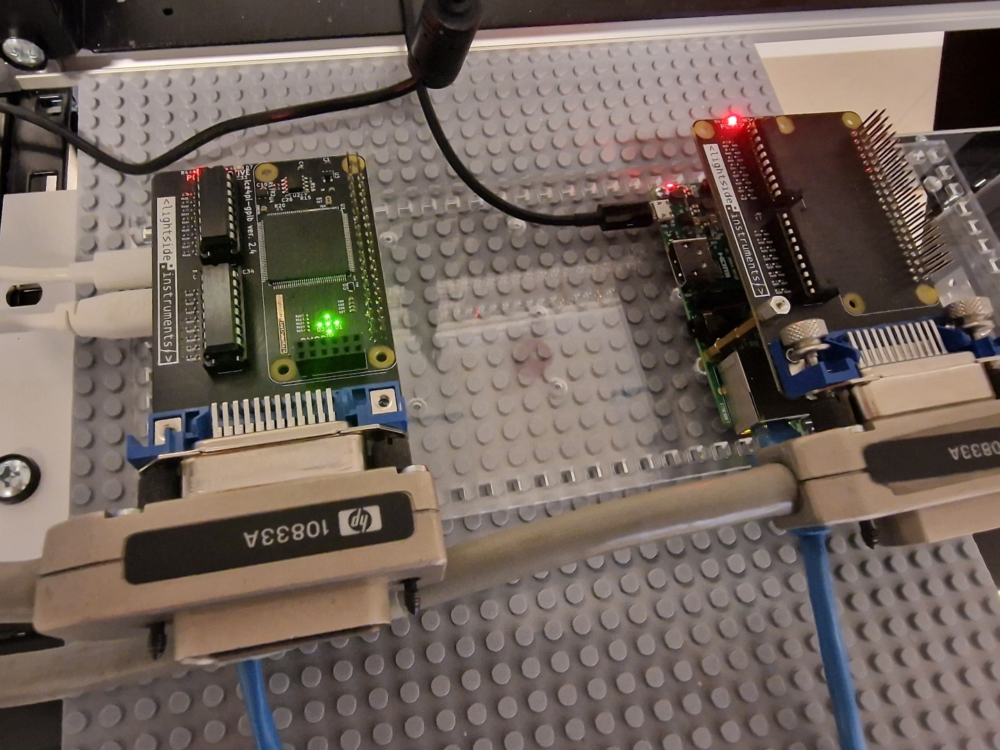

# Setup


A reference peer for the tested device based on a FPGA instrumented board ice4pi-gpib is connected to the tested adapter.
It responds to limited set of GPIB operations (read,write,SRQ interrupt sequence etc.) but in a very deterministic way that can be simulated at gate level.
So testing should provide consistent results and the behavior of the bus should be possible to reproduce.

# GPIB scope acquisition of test sessions

## Synthesizing and loading the gateware

Build and install https://github.com/lightside-instruments/ice4pi-example-i2cslave/tree/ice4pi-example-gpib-scope

## Sending the binary 16bit sampled at 5MHz data over the 1Gb ethernet interface: 
On ice4pi-gpib device:
```
dd if=/dev/zero bs=$((4*1024)) iflag=fullblock | spi-pipe -d /dev/spidev0.1 --blocksize=$((4*1024)) -s 80000000 | nc -l 0.0.0.0 1234
```

On host(laptop):
nc 10.0.0.1 1234 | tee /tmp/gpib.bin | hexdump -C


# Build and load module
These instructions are specific for the gpib_bitbang.ko module and the gpib4pi adapter:


```
git clone -b debian/4.3.6-lsi5 https://github.com/lightside-instruments/gpib-debian.git gpib
cd gpib
cat debian/patches/backport-gpib-bitbang.patch | patch -p1
cd linux-gpib-kernel
export GPIB_DEBUG=1
make
sudo rmmod gpib_bitbang
sudo insmod ./drivers/gpib/gpio/gpib_bitbang.ko gpio_offset=512 debug=9

[31392.526989] gpib: registered gpib_bitbang interface
[31392.527025] gpib_bitbang:bb_init_module - module loaded with pin map "elektronomikon" and SN7516x driver support
[31399.676641] gpib debug: pid 6945, gpib: opening minor 0
[31399.708258] gpib debug: pid 6945, gpib: request module returned 256
[31399.708395] gpib debug: pid 6945, minor 0, ioctl 39, interface=, use=0, onl=0
[31399.708446] gpib debug: pid 6945, minor 0, ioctl 24, interface=, use=0, onl=0
[31399.708475] gpib debug: pid 6945, minor 0, ioctl 21, interface=gpib_bitbang, use=1, onl=0
[31399.708499] gpib debug: pid 6945, minor 0, ioctl 22, interface=gpib_bitbang, use=1, onl=0
[31399.708522] gpib debug: pid 6945, minor 0, ioctl 23, interface=gpib_bitbang, use=1, onl=0
[31399.708544] gpib debug: pid 6945, minor 0, ioctl 15, interface=gpib_bitbang, use=1, onl=0
[31399.708564] gpib debug: set primary addr to 0
[31399.708576] gpib debug: pid 6945, minor 0, ioctl 16, interface=gpib_bitbang, use=1, onl=0
[31399.708596] gpib debug: set secondary addr to -96
[31399.708610] gpib debug: pid 6945, minor 0, ioctl 32, interface=gpib_bitbang, use=1, onl=0
[31399.708654] gpib debug: pid 6945, minor 0, ioctl 43, interface=gpib_bitbang, use=1, onl=0
[31399.708752] gpib debug: pid 6945, minor 0, ioctl 39, interface=gpib_bitbang, use=1, onl=0

pi@raspberrypi:~/gpib/linux-gpib-kernel $ sudo gpib_config

[31399.708804] gpib_bitbang:bb_attach - Enter ...
[31399.708823] gpib_bitbang:bb_attach - Using pin map "elektronomikon"  with SN7516x driver support
[31399.709032] gpib_bitbang:bb_get_irq - IRQ gpib_bitbang_DAV: 160
[31399.709100] gpib_bitbang:bb_get_irq - IRQ gpib_bitbang_NRFD: 161
[31399.709139] gpib_bitbang:bb_get_irq - IRQ gpib_bitbang_NDAC: 162
[31399.709176] gpib_bitbang:bb_get_irq - IRQ gpib_bitbang_SRQ: 163
[31399.709213] gpib_bitbang:bb_attach - attached board 0
[31399.709492] gpib debug: gpib: board online
[31399.711019] gpib debug: pid 6945, gpib: opening minor 0
[31399.711099] gpib debug: pid 6945, minor 0, ioctl 26, interface=gpib_bitbang, use=2, onl=1
[31399.711129] gpib debug: pid 6945, locked board 0 mutex
[31399.711147] gpib debug: pid 6945, minor 0, ioctl 34, interface=gpib_bitbang, use=2, onl=1
[31399.711169] gpib_bitbang:bb_request_system_control - 1
[31399.711218] gpib debug: pid 6945, minor 0, ioctl 5, interface=gpib_bitbang, use=2, onl=1
[31399.711247] gpib_bitbang:bb_update_status - 0x30 mask 0x0
[31399.711268] gpib_bitbang:bb_line_status - status lines: 58ff
[31399.711294] gpib debug: pid 6945, minor 0, ioctl 26, interface=gpib_bitbang, use=2, onl=1
[31399.711315] gpib debug: pid 6945, unlocked board 0 mutex
[31399.711366] gpib debug: pid 6945, minor 0, ioctl 26, interface=gpib_bitbang, use=2, onl=1
[31399.711390] gpib debug: pid 6945, locked board 0 mutex
[31399.711406] gpib debug: pid 6945, minor 0, ioctl 29, interface=gpib_bitbang, use=2, onl=1
[31399.711429] gpib debug: pid 6945, minor 0, ioctl 9, interface=gpib_bitbang, use=2, onl=1
[31399.711449] gpib debug: sending interface clear
[31399.711458] gpib_bitbang:bb_interface_clear - 1
[31399.711575] gpib_bitbang:bb_interface_clear - 0
[31399.711596] gpib debug: pid 6945, minor 0, ioctl 5, interface=gpib_bitbang, use=2, onl=1
[31399.711619] gpib_bitbang:bb_update_status - 0x30 mask 0x0
[31399.711638] gpib_bitbang:bb_line_status - status lines: 50ff
[31399.711659] gpib debug: pid 6945, minor 0, ioctl 26, interface=gpib_bitbang, use=2, onl=1
[31399.711679] gpib debug: pid 6945, unlocked board 0 mutex
[31399.711713] gpib debug: pid 6945, minor 0, ioctl 26, interface=gpib_bitbang, use=2, onl=1
[31399.711737] gpib debug: pid 6945, locked board 0 mutex
[31399.711753] gpib debug: pid 6945, minor 0, ioctl 29, interface=gpib_bitbang, use=2, onl=1
[31399.711775] gpib debug: pid 6945, minor 0, ioctl 10, interface=gpib_bitbang, use=2, onl=1
[31399.711796] gpib_bitbang:bb_remote_enable - 1
[31399.711819] gpib debug: pid 6945, minor 0, ioctl 5, interface=gpib_bitbang, use=2, onl=1
[31399.711843] gpib_bitbang:bb_update_status - 0x70 mask 0x0
[31399.711861] gpib_bitbang:bb_line_status - status lines: 50ff
[31399.711883] gpib debug: pid 6945, minor 0, ioctl 26, interface=gpib_bitbang, use=2, onl=1
[31399.711904] gpib debug: pid 6945, unlocked board 0 mutex
[31399.711940] gpib debug: pid 6945, gpib: closing minor 0
[31399.712862] gpib debug: pid 6945, gpib: closing minor 0
[31399.713193] gpib debug: entering autospoll thread

pi@raspberrypi:~/gpib/linux-gpib-kernel $ 

```

# Building and running testsuite

```
git clone https://github.com/lightside-instruments/linux-gpib-test.git linux-gpib-test
cd linux-gpib-test
autoreconf -i -f
./configure
make
make check
```
